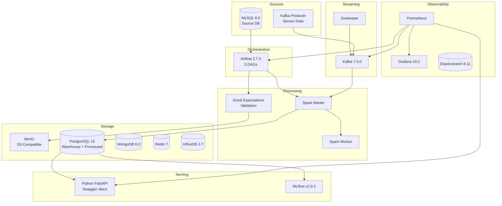

# Enterprise data platform from ingestion to governance

[](https://www.python.org/)
[](https://fastapi.tiangolo.com/)
[](https://airflow.apache.org/)
[](https://spark.apache.org/)
[](https://kafka.apache.org/)
[](https://www.snowflake.com/)
[](https://www.postgresql.org/)
[](https://www.mysql.com/)
[](https://www.mongodb.com/)
[](https://redis.io/)
[](https://min.io/)
[](https://www.influxdata.com/)
[](https://www.elastic.co/)
[](https://mlflow.org/)
[](https://prometheus.io/)
[](https://grafana.com/)
[](https://www.docker.com/)
[](https://kubernetes.io/)
[](https://www.terraform.io/)
[](https://helm.sh/)
[](https://www.learnwithparam.com)

A production-grade, fully containerized data platform with batch ingestion, real-time streaming, a star-schema warehouse, ML experiment tracking, lineage, observability, and a FastAPI control plane, all orchestrated through **20 Docker services** managed by a single `docker compose` stack.

This is the top tier of the [learnwithparam.com](https://www.learnwithparam.com) data engineering track. It follows:

- **[`data-engineering-medallion`](../data-engineering-medallion)** — beginner, notebook-first, DuckDB + Pandas medallion pattern.
- **[`data-engineering-pipeline`](../data-engineering-pipeline)** — intermediate, trimmed Airflow + Spark + Postgres + MinIO + FastAPI stack.
- **`end-to-end-data-pipeline`** (this repo) — the full production platform with Kafka, Snowflake, MLflow, Prometheus, Grafana, Kubernetes, Terraform, and Helm.

Start the course: [learnwithparam.com/courses/end-to-end-data-pipeline](https://www.learnwithparam.com/courses/end-to-end-data-pipeline)
Join the full program: [learnwithparam.com/data-engineering-bootcamp](https://www.learnwithparam.com/data-engineering-bootcamp)

## What you'll build

By the end of this project you will have:

- A **20-service reference platform** that combines batch, streaming, warehouse, ML, and observability in one runnable stack
- A **Kafka + Spark streaming path** that sits beside the Airflow batch path without mixing responsibilities
- A **Postgres and Snowflake-ready warehouse model** that mirrors how enterprise teams separate operational and analytical storage
- An **MLflow and lineage layer** so experiments and data provenance live inside the platform instead of outside it
- A **Prometheus + Grafana monitoring setup** that gives on-call engineers a real operational view
- A **FastAPI control plane** that exposes health, pipeline operations, and platform status through one interface

## Table of Contents

- [Architecture](#architecture)
- [Technology Stack](#technology-stack)
- [Prerequisites](#prerequisites)
- [Quick Start](#quick-start)
- [Service URLs](#service-urls)
- [API Documentation (Python FastAPI)](#api-documentation-python-fastapi)
- [Data Warehouse Schema](#data-warehouse-schema)
- [Airflow DAGs](#airflow-dags)
- [Testing](#testing)
- [CI/CD Pipeline](#cicd-pipeline)
- [Project Structure](#project-structure)
- [Credits](#credits)
- [License](#license)

## Architecture



Detailed mermaid diagrams live in `ARCHITECTURE.md`.

## Technology Stack

- **Python 3.11** + **uv** — one language and toolchain across the control plane and platform tooling
- **Apache Airflow 2.7.3** — orchestration, 3 DAGs (`batch_ingestion_dag`, `streaming_monitoring_dag`, `warehouse_transform_dag`)
- **Apache Kafka 7.5.0** + Zookeeper — streaming ingest
- **Apache Spark 3.5.3** (master + workers) — batch + streaming ETL
- **PostgreSQL 15** — warehouse (star schema) + processed DB
- **MySQL 8.0** — source OLTP
- **MongoDB 6.0**, **Redis 7**, **InfluxDB 2.7** — mixed-workload datastores
- **MinIO** — S3-compatible raw/processed lake
- **Great Expectations** — data quality
- **MLflow 2.9.2** — experiment tracking
- **Elasticsearch 8.11** — log search
- **Prometheus 2.48** + **Grafana 10.2** — metrics & dashboards
- **FastAPI** + **pydantic-settings** + **structlog** — the API and its typed config
- **Docker Compose** + **Kubernetes** + **Terraform** + **Helm** — local through cloud deploys

## Prerequisites

- Docker Desktop (or Docker Engine + Compose) with ~18 GB RAM available, or ~8 GB for the lite profile
- `make`, `curl`, `git`
- Python 3.11 + [`uv`](https://astral.sh/uv) for local-only FastAPI runs
- (Optional) `kubectl`, `terraform`, `helm` for cluster deploys

## Quick Start

### Just the FastAPI (no compose, no Docker)

```bash
uv sync
cp .env.example .env
make run            # /docs on http://localhost:8000/docs
```

### Full stack

```bash
make setup
make up             # 20 services, ~18 GB RAM
make urls           # list service URLs
make trigger-batch  # trigger the batch DAG
make down
```

### Lite stack (~8 GB)

```bash
make up-lite
```

### Smoke test

```bash
bash ../smoke_test_all.sh end-to-end-data-pipeline
```

The FastAPI is designed for graceful degradation — every health check and controller endpoint returns a sane response when the upstream service isn't running, so the smoke test exercises the whole API surface without needing the full compose stack.

## Service URLs

| Service       | URL                               |
|---------------|-----------------------------------|
| Airflow UI    | http://localhost:8080             |
| FastAPI /docs | http://localhost:5000/docs        |
| MinIO Console | http://localhost:9001             |
| Grafana       | http://localhost:3000             |
| MLflow        | http://localhost:5001             |
| Spark Master  | http://localhost:8081             |
| Prometheus    | http://localhost:9090             |
| Elasticsearch | http://localhost:9200             |
| Kafka         | localhost:9092                    |

## API Documentation (Python FastAPI)

All endpoints live under `/api/*` plus the three standard `/health` probes. Auto-generated Swagger is at `http://localhost:5000/docs` (when running under compose) or `http://localhost:8000/docs` (when running locally with `make run`).

Endpoint map:

| Endpoint group | Route | Method | Purpose |
|---|---|---|---|
| Batch | `/api/batch/ingest`, `/api/batch` | POST | Ingest from MySQL, upload to MinIO, optionally validate with GE + trigger Airflow |
| Streaming | `/api/stream/produce` | POST | Produce a Kafka message |
| Streaming | `/api/stream/run` | POST | Trigger the streaming DAG |
| Warehouse | `/api/warehouse/transform` | POST | Trigger warehouse transform DAG |
| Warehouse | `/api/warehouse/aggregations/daily-orders` | GET | Describe the daily-orders mart |
| Warehouse | `/api/warehouse/pipeline-runs` | GET | Describe the pipeline-runs fact |
| Warehouse | `/api/warehouse/health` | GET | Warehouse-specific health |
| Warehouse | `/api/warehouse/snowflake/status` | GET | Snowflake config status |
| ML | `/api/ml/run?expId=...&name=...` | POST | Create an MLflow run |
| Monitoring | `/api/monitor/health` | GET | Aggregate health map |
| Governance | `/api/governance/lineage` | POST | Register lineage with Apache Atlas |
| CI/CD | `/api/ci/trigger?wf=...&branch=...` | POST | Trigger a GitHub Actions workflow |
| Health | `/health`, `/health/ready`, `/health/live` | GET | k8s-style probes |

## Data Warehouse Schema

Star schema lives in `scripts/init_warehouse.sql`. See `ARCHITECTURE.md` for ER diagrams and `snowflake/` for the Snowflake mirror.

## Airflow DAGs

- `batch_ingestion_dag` — MySQL → GE → MinIO (raw) → Spark batch → Postgres warehouse
- `streaming_monitoring_dag` — Kafka → Spark streaming → Elasticsearch + InfluxDB
- `warehouse_transform_dag` — Postgres → Snowflake (or Postgres marts)

Trigger them:

```bash
make trigger-batch
make trigger-warehouse
make list-dags
```

## Testing

```bash
make test           # pytest
make lint           # ruff
make format         # black + isort
```

## CI/CD Pipeline

See `.github/workflows/` for GitHub Actions workflows, `terraform/` for IaC, and `helm/e2e-pipeline/` for the Helm chart. Multi-provider deploys are scripted behind `make deploy-*`:

```bash
make deploy-local     # Docker Compose
make deploy-lite      # Docker Compose (~8 GB)
make deploy-k8s       # Helm on any cluster
make deploy-aws       # EKS via Terraform + Helm
make deploy-gcp       # GKE via Helm
make deploy-azure     # AKS via Helm
make deploy-onprem    # k3s / kubeadm via Helm
```

## Project Structure

```
end-to-end-data-pipeline/
├── main.py                  FastAPI app
├── router.py                API routes
├── models.py                Pydantic models
├── config/                  typed configuration
├── healthchecks/            service health probes
├── services/                platform service integrations
├── airflow/                 DAGs + Airflow Dockerfile + plugins
├── spark/                   Batch + streaming jobs + Spark Dockerfile
├── kafka/                   Producer + Dockerfile
├── storage/                 Mongo / Redis / Influx / Elastic integration scripts
├── snowflake/               Snowflake schema + optional deploy
├── governance/              Atlas lineage config
├── great_expectations/      Expectations + checkpoints
├── ml/                      MLflow pipelines
├── monitoring/              Prometheus + Grafana config
├── bi_dashboards/           Static BI dashboards
├── kubernetes/              K8s manifests
├── helm/                    Helm chart (e2e-pipeline)
├── terraform/               AWS / GCP / Azure IaC
├── scripts/                 deploy.sh, init_db.sql, init_warehouse.sql
├── tests/                   pytest suite
├── docker-compose.yaml      20-service stack
├── docker-compose.lite.yaml lite profile
├── pyproject.toml           uv-managed deps
├── uv.lock
├── Makefile                 60+ targets
├── Dockerfile               python:3.11-slim + uv (API)
├── CLAUDE.md                guidance for Claude Code
└── README.md
```

## Credits

This project is a learnwithparam.com workshop adaptation of the open-source [End-to-End Data Pipeline](https://github.com/hoangsonww/End-to-End-Data-Pipeline) reference architecture by **Son Nguyen** (MIT). Original attribution and license terms are preserved in `LICENSE`.

## Learn more

- Start the course: [learnwithparam.com/courses/end-to-end-data-pipeline](https://www.learnwithparam.com/courses/end-to-end-data-pipeline)
- Data Engineering Bootcamp: [learnwithparam.com/data-engineering-bootcamp](https://www.learnwithparam.com/data-engineering-bootcamp)
- All courses: [learnwithparam.com/courses](https://www.learnwithparam.com/courses)


## License

MIT. See `LICENSE`.
